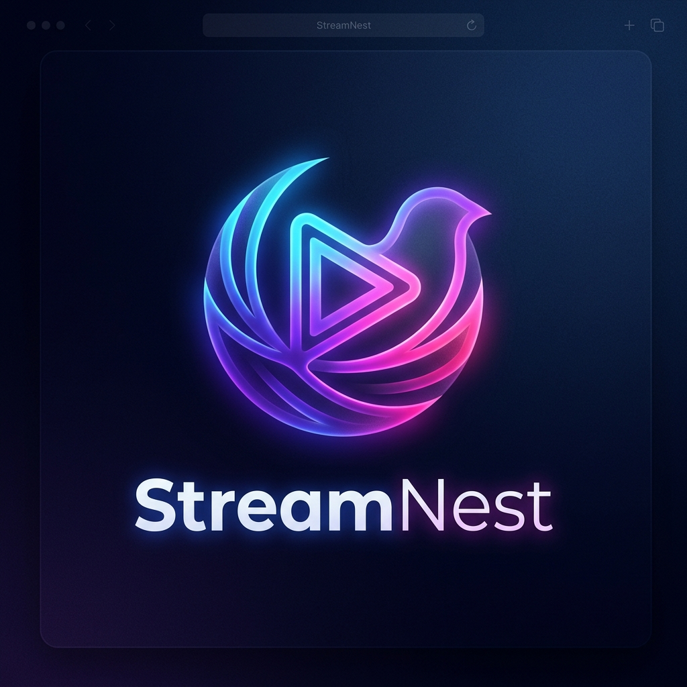

<p align="center">
  
</p>

<h1 align="center">StreamNest</h1>

<p align="center">
  <strong>A cinema that lives in your browser.</strong>
</p>

<p align="center">
  <em>Premium, zero-backend, browser-native media player — designed to transform local files into a cinematic OTT experience.</em>
</p>

<p align="center">
  <a href="#-features"></a>
  
  
  
  
  
</p>

<p align="center">
  <a href="#-quick-start">Quick Start</a> •
  <a href="#-features">Features</a> •
  <a href="#-architecture">Architecture</a> •
  <a href="#-screenshots">Screenshots</a> •
  <a href="#-keyboard-shortcuts">Shortcuts</a> •
  <a href="#-deployment">Deployment</a>
</p>

---

## 🎯 Why StreamNest?

Most local media players feel outdated, utilitarian, and ugly. StreamNest changes that.

It brings the **Netflix / Prime Video / JioHotstar** experience to your **downloaded movies and web series** — right in the browser. No servers, no uploads, no cloud. Just drop your files and enjoy a **cinema-grade UI** with binge-watching intelligence, a studio-quality audio engine, and the kind of polish usually reserved for billion-dollar streaming platforms.

> **Think of it as:** VLC meets Netflix — running entirely in your browser with zero installation.

---

## ✨ Features

### 🎬 Cinematic Player Engine

| Feature | Description |
| :--- | :--- |
| **Local File Playback** | Drag & drop `MP4`, `WebM`, `MKV`, and audio files — plays instantly via `ObjectURL` streaming |
| **HLS / DASH Streaming** | Adaptive bitrate playback via dynamic `hls.js` and `dash.js` imports for `.m3u8` and `.mpd` URLs |
| **Picture-in-Picture** | Native PiP support — keep watching while multitasking in other apps or tabs |
| **Playback Speed Control** | Cycle through playback rates with a single click (`0.25x` → `2x`) |
| **Screenshot Capture** | One-click high-resolution PNG frame export via `Canvas` rendering |
| **Video Brightness** | Real-time CSS filter brightness control via gesture zones |
| **Resume Playback** | Auto-saves progress every 10 seconds — pick up exactly where you left off |

---

### 📺 OTT Binge-Watching Suite

A complete series-viewing experience, engineered for binge sessions.

| Feature | Description |
| :--- | :--- |
| **Smart Episode Parser** | Automatically detects show name, season, episode number, and title from filenames (`S01E03`, `1x03`, `Episode 3`, etc.) |
| **Netflix-Style Episode Drawer** | Horizontal episode cards with gradient thumbnails, watch progress bars, and animated "now playing" indicators |
| **Season Pill Selector** | Sleek horizontal season tabs that auto-synchronize to the currently playing episode's season |
| **Next Episode Autoplay** | Cinematic 15-second countdown overlay with circular SVG progress animation — skips to the next episode automatically |
| **Skip Intro / Skip Recap** | Floating OTT-style pill buttons during intro and recap segments with configurable per-episode timing |
| **Auto-Subtitle Matching** | Automatically pairs `.srt` / `.vtt` files to the correct episode by name or season/episode pattern |
| **Playback Continuity** | Volume, mute state, playback speed, and subtitle preferences persist across episode transitions |

---

### 🔊 Pro Audio Engine

Built on the **Web Audio API** with a professional-grade signal chain.

```
Source → 10-Band Parametric EQ → Bass Shelf → Treble Shelf → Clarity Peak → Output
```

| Feature | Description |
| :--- | :--- |
| **10-Band Parametric EQ** | Precision frequency shaping across `32 Hz` → `16 kHz` |
| **Bass Boost** | Low-shelf filter at `100 Hz` for subwoofer-style enhancement |
| **Treble Control** | High-shelf filter at `10 kHz` for crisp dialogue and detail |
| **Clarity Enhancer** | Peaking filter at `3 kHz` — boosts vocal presence and intelligibility |
| **Audio Track Demuxer** | Client-side binary parser (EBML/ISO BMFF) extracts embedded audio tracks with language, codec, and channel layout metadata |
| **External Audio Sync** | Load and synchronize external audio tracks (`.m4a`, `.ac3`) with frame-accurate `0.3s` drift correction |
| **Premium Track Browser** | Netflix/VLC-style card UI with `EMBEDDED` / `SYNCED EXT` badges and codec specs (`Dolby 5.1 • AC3`, `Stereo • AAC`) |

---

### 📝 Subtitle System

| Feature | Description |
| :--- | :--- |
| **SRT / VTT Support** | Full `.srt` and `.vtt` parser with millisecond-accurate cue rendering |
| **Drag & Drop Loading** | Drop subtitle files directly into the player — auto-detected and applied |
| **Font Size** | Adjustable from `16px` to `48px` |
| **Text Color** | Full color picker for subtitle text |
| **Background Opacity** | Translucent to solid backdrop for readability on any scene |
| **Vertical Position** | Fine-tune subtitle placement from `20px` to `300px` above the bottom edge |

---

### 🖱️ Smart Interaction System

| Feature | Description |
| :--- | :--- |
| **Tap to Play/Pause** | Click anywhere on the video surface — intelligently ignores UI control clicks |
| **Gesture Zones** | Left half controls **volume**, right half controls **brightness** via arrow keys |
| **Visual Feedback** | Glassmorphism popups confirm volume (`🔊`) and brightness (`☀️`) adjustments |
| **Auto-Hide Controls** | Controls overlay fades out after idle cursor — reappears on any interaction |
| **Seekbar Thumbnail Preview** | Live canvas-captured frame previews on seekbar hover with timestamp display |
| **OS Media Integration** | Full `navigator.mediaSession` — hardware play/pause keys, trackpad gestures, and lock-screen controls |

---

### 🎨 Themes & Customization

Five curated cinematic themes — applied in real-time via CSS custom properties:

| Theme | Accent |
| :--- | :--- |
| **Cyberpunk** | `#00f0ff` — Electric cyan |
| **Neon Red** | `#ff0055` — Hot pink-red |
| **Matrix Green** | `#00ff41` — Terminal phosphor |
| **Golden Cinema** | `#ffd700` — Classic gold |
| **Purple Haze** | `#b700ff` — Deep violet |

All theme colors cascade through the particle engine, progress bars, active states, and gradient accents system-wide.

---

### 💎 UI / UX Design

| Element | Implementation |
| :--- | :--- |
| **Glassmorphism** | `backdrop-filter: blur()` with layered translucent surfaces throughout all overlays |
| **Cinematic Welcome Intro** | Multi-stage animated brand reveal with ambient glow orbs, fog, lens flare, and particle drift |
| **Interactive Landing** | 3D tilt-effect drop zone powered by a custom Canvas particle engine |
| **Animated Typography** | Gradient text with floating micro-animations on the brand identity |
| **Responsive Layout** | Fluid scaling across desktop, tablet, and mobile viewports |
| **Mini Player** | Persistent floating player with drag support for background playback |
| **Notification System** | Toast-style alerts for user actions |

---

## 🏗️ Architecture

StreamNest uses a **hybrid architecture** — vanilla JavaScript modules for performance-critical media logic, with React components for reactive UI overlays.

```
streamnest/
├── index.html                    # App shell & player skeleton
├── style.css                     # Design system (glassmorphism, animations, themes)
├── vite.config.js                # Vite build configuration
├── postcss.config.cjs            # TailwindCSS PostCSS pipeline
├── vercel.json                   # SPA routing for Vercel deployment
│
├── public/
│   ├── logo.png                  # Brand asset
│   └── favicon.png               # Browser tab icon
│
└── src/
    ├── main.js                   # Entry point, global MediaState
    │
    ├── modules/                  # Core engine layer (vanilla JS)
    │   ├── VideoCore.js          # HTML5 video abstraction + external audio sync
    │   ├── AudioCore.js          # Web Audio API signal chain (EQ + FX)
    │   ├── StreamCore.js         # HLS/DASH adaptive streaming
    │   ├── SubtitleEngine.js     # SRT/VTT parser and real-time renderer
    │   ├── PlaybackManager.js    # localStorage persistence for resume playback
    │   ├── PlaybackTracker.js    # Active session progress tracking
    │   ├── PlaylistManager.js    # Multi-file series management & episode sorting
    │   ├── KeyboardController.js # Global keyboard shortcut handler
    │   ├── ParticleEngine.js     # Canvas-based ambient particle background
    │   ├── ThemeManager.js       # CSS custom property theme switching
    │   ├── FileEngine.js         # File input / drag-drop processing
    │   ├── ControlBus.js         # Pub/sub event bus for decoupled module communication
    │   ├── RenderPipeline.js     # Coordinated UI render cycle
    │   ├── AudioTrackManager.js  # Embedded & external audio track routing
    │   └── UIController.jsx      # Master controller bridging vanilla ↔ React
    │
    ├── ui/                       # React component layer
    │   ├── GlobalPlayer.jsx      # Root overlay mount (Next Episode, Skip, etc.)
    │   ├── NextEpisodeOverlay.jsx # Netflix-style autoplay countdown overlay
    │   ├── SkipOverlay.jsx       # Skip Intro / Skip Recap pill buttons
    │   ├── EpisodesDrawer.jsx    # Side-panel episode browser with season tabs
    │   ├── AudioTracksDrawer.jsx # Premium audio track selection panel
    │   ├── MiniPlayer.jsx        # Floating mini-player with drag support
    │   ├── WelcomeIntro.jsx      # Cinematic brand intro sequence
    │   ├── AmbientTheater.jsx    # Ambient light effects for player
    │   ├── ControlBar.js         # Player control bar component
    │   ├── FileDropZone.js       # Drag & drop target UI
    │   ├── SubtitleOverlay.js    # Subtitle rendering overlay
    │   └── Notifications.js      # Toast notification system
    │
    ├── utils/                    # Utility modules
    │   ├── ThumbnailGenerator.js # Offscreen video clone for seekbar frame capture
    │   ├── SkipTimingManager.js  # Per-episode intro/recap timing database
    │   ├── episodeParser.js      # Filename → show/season/episode metadata parser
    │   ├── audioTrackParser.js   # Binary EBML/BMFF audio track header parser
    │   └── timeFormatter.js      # Duration formatting utilities
    │
    ├── context/
    │   └── PlayerContext.jsx     # React context for cross-component state
    │
    └── hooks/
        └── usePlayback.js        # React hook for resume playback persistence
```

### Key Design Decisions

| Decision | Rationale |
| :--- | :--- |
| **Vanilla JS core + React overlays** | Media engines need direct DOM access and tight event loop control; React handles declarative UI overlays |
| **ControlBus pub/sub** | Decouples modules — keyboard, gestures, and UI all communicate through a central event bus |
| **ObjectURL streaming** | Files never leave the browser — zero upload, zero latency, maximum privacy |
| **Offscreen video cloning** | Seekbar thumbnail generation uses a hidden `<video>` clone to avoid interrupting main playback |
| **CSS custom properties for theming** | Single-source-of-truth for colors — themes cascade instantly through every component |

---

## 📸 Screenshots

### Landing Page


*Cinematic drop zone with interactive particles, 3D tilt effect, and animated branding.*

### Player UI


*Glassmorphism control overlay with seekbar thumbnail preview and gesture feedback.*

### Pro Settings


*10-band parametric EQ, audio FX, subtitle customization, and theme switching.*

---

## ⌨️ Keyboard Shortcuts

| Key | Action |
| :--- | :--- |
| `Space` | Toggle Play / Pause |
| `←` / `→` | Seek backward / forward 5 seconds |
| `↑` / `↓` | Volume up / down (left zone) or Brightness (right zone) |
| `F` | Toggle Fullscreen |
| `M` | Toggle Mute |
| `P` | Toggle Picture-in-Picture |
| `1` – `9` | Jump to 10% – 90% of video duration |
| `?` | Toggle keyboard shortcuts overlay |
| **Media Keys** | Hardware play, pause, and seek (±10s) |

---

## 🚀 Quick Start

```bash
# Clone the repository
git clone https://github.com/arupdas0825/streamnest.git
cd streamnest

# Install dependencies
npm install

# Start the development server
npm run dev
```

Open **http://localhost:5173** — drag your media files into the drop zone and enjoy.

---

## 🌍 Deployment

StreamNest is a fully static SPA — deploy to any static hosting platform with zero configuration.

```bash
# Build the production bundle
npm run build

# Preview the optimized build locally
npm run preview
```

### Vercel (Recommended)

A `vercel.json` is included for clean SPA routing. Connect the repo and deploy — zero config required.

### Other Platforms

Works out of the box on **Netlify**, **GitHub Pages**, **Cloudflare Pages**, or any static file server.

---

## 🛠️ Tech Stack

| Layer | Technology |
| :--- | :--- |
| **UI Framework** | React 18 (JSX components for overlays and drawers) |
| **Core Engine** | Vanilla JavaScript ES Modules (media, audio, gestures) |
| **Styling** | TailwindCSS 4 + Vanilla CSS (glassmorphism, animations) |
| **Build** | Vite 5 (HMR, tree-shaking, optimized production builds) |
| **Audio** | Web Audio API (10-band EQ, bass/treble/clarity FX chain) |
| **Media** | HTML5 Video API, Media Session API, Canvas API |
| **Streaming** | hls.js (HLS) + dash.js (MPEG-DASH) — lazy-loaded on demand |
| **Persistence** | `localStorage` (playback history, settings, skip timings) |
| **Backend** | **None** — 100% client-side, fully offline-capable |

---

## 🗺️ Roadmap

- [ ] **Chromecast / AirPlay** — Cast to TV directly from the browser
- [ ] **Watch Party** — WebRTC-based synchronized viewing with friends
- [ ] **AI Auto-Skip** — Detect intros/credits automatically using audio fingerprinting
- [ ] **Offline PWA** — Service worker for full offline app experience
- [ ] **Continue Watching** — Dashboard view with resume cards across all media
- [ ] **Custom Subtitle Fonts** — Google Fonts integration for subtitle styling
- [ ] **Gesture Controls (Mobile)** — Swipe to seek, pinch to zoom
- [ ] **Video Filters** — Contrast, saturation, and warm/cool color grading
- [ ] **Multi-Window Sync** — Sync playback across multiple browser windows

---

## 🤝 Contributing

Contributions are welcome! Whether it's a bug fix, feature, or design improvement — feel free to open an issue or submit a PR.

```bash
# Fork the repo, create a feature branch
git checkout -b feature/amazing-feature

# Make your changes and commit
git commit -m "feat: add amazing feature"

# Push and open a Pull Request
git push origin feature/amazing-feature
```

---

## 📄 License

This project is licensed under the **MIT License** — see the [LICENSE](LICENSE) file for details.

---

<p align="center">
  <strong>Built with obsessive attention to detail by <a href="https://github.com/arupdas0825">Arup</a></strong>
</p>

<p align="center">
  <em>If StreamNest impressed you, consider giving it a ⭐ on GitHub — it means the world.</em>
</p>
